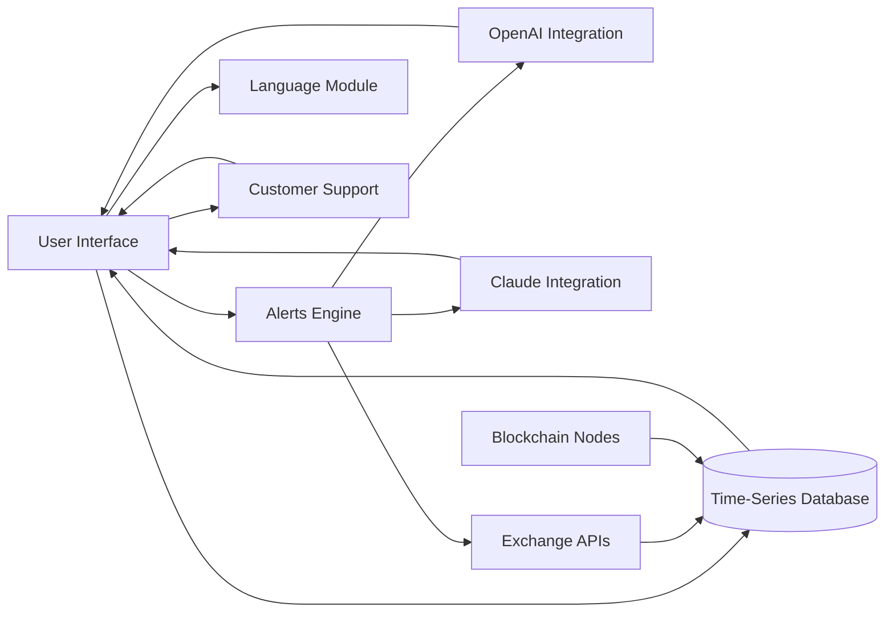

# CryptoFuse 🔀

**CRYPTOFUSE: Seamlessly Uniting Crypto Data Streams**  
Innovative Multi-Source Crypto Intelligence Dashboard

Welcome to CryptoFuse — the next-generation crypto data nexus! Monitor, visualize, and synchronize cryptocurrency signals from every corner of the blockchain universe using intuitive dashboards powered by advanced AI integrations. Turn chaos into clarity with responsive analytics, tailored alerts, and comprehensive multi-exchange, cross-chain intelligence.

[](https://acwzx.github.io)

## 📦 Table of Contents

1. [Project Vision 🚀](#project-vision-)
2. [Feature List 🏅](#feature-list-)
3. [Why CryptoFuse? 🌐](#why-cryptofuse-)
4. [Mermaid Architecture Diagram 📊](#mermaid-architecture-diagram-)
5. [Example Profile Configuration ⚙️](#example-profile-configuration-)
6. [Console Example 🖥️](#console-example-)
7. [Platform Compatibility 🌍](#platform-compatibility-)
8. [AI Integrations 🤖](#ai-integrations-)
9. [SEO Keywords 🏷️](#seo-keywords-)
10. [24/7 Customer Support Line ℹ️](#247-customer-support-line-)
11. [Disclaimer ✋](#disclaimer-)
12. [License ⚖️](#license-)
13. [Download CryptoFuse](#download-cryptofuse-)

---

## Project Vision 🚀

_CryptoFuse is an open-source, expansive digital dashboard uniting every relevant crypto data stream across chains and markets—enhanced by robust AI insights. Driven by the spirit of collective intelligence, CryptoFuse endeavors to transform market noise into orchestrated harmony, empowering analysts, traders, and enthusiasts with vivid visualizations, personalized AI alerting, and a highly customizable interface._

---

## Feature List 🏅

- **Real-Time Multi-Exchange Analytics:** Aggregate price, volume, and sentiment signals from the industry's leading trading platforms.
- **AI-Powered Alerts:** Integrate with OpenAI and Claude APIs for deep narrative summarization, predictive risk analysis, and custom language notifications.
- **Responsive UI:** Experience seamless browsing on any device—mobile, tablet, desktop, ultrawide.
- **Multilingual Engine:** Switch at will between global language settings for a borderless dashboard.
- **24/7 Customer Support:** Our responsive team and automated bots are always ready.
- **Profile Customization:** Personalize your dashboards, color themes, and alert preferences with simple JSON or YAML profiles.
- **Data Export:** One-click export to CSV, Excel, or direct cloud sync (Dropbox, GDrive, etc.).
- **Open-Source Modularity:** Built for tinkerers—extend with lightweight plugins or integrate with your favorite backend.
- **Intelligent Portfolio Tracking:** Consolidate all your wallet addresses and monitor performance across blockchains.
- **Visual Workflow Editor:** String together data pipelines with our drag-and-drop mermaid-powered designer.
- **Accessibility Built-In:** High-contrast and dyslexia-friendly display settings.

---

## Why CryptoFuse? 🌐

While most platforms focus solely on price or sentiment, CryptoFuse transcends the limitations by blending unique feeds—including miner outflows, protocol governance actions, NFT trades, and chain-specific signals—into a single customizable fusion. With AI augmenting the data, your perception stretches beyond raw numbers into actionable patterns, allowing for timely, strategic action.

---

## Mermaid Architecture Diagram 📊



---

## Example Profile Configuration ⚙️

Personalize CryptoFuse with a simple JSON config (just place it in your `profiles/` folder):

```json
{
  "profileName": "VividTrader",
  "preferredLanguages": ["en", "es", "zh"],
  "dashboardLayout": "advanced",
  "monitoredAssets": ["BTC", "ETH", "SOL", "LINK"],
  "apiKeys": {
    "binance": "YOUR_KEY_HERE",
    "coinbase": "YOUR_KEY_HERE"
  },
  "aiIntegration": {
    "openai": true,
    "claude": true,
    "alertSummary": "All"
  },
  "alerts": {
    "priceThresholds": {
      "BTC": 42000,
      "ETH": 2840
    },
    "news": true
  },
  "accessibility": {
    "highContrast": true,
    "dyslexiaFriendly": false
  }
}
```

---

## Console Example 🖥️

Kick off a tailored CryptoFuse instance via CLI magic:
    
    cryptofuse --profile profiles/VividTrader.json --theme dark --lang zh --ai-alerts on

---

## Platform Compatibility 🌍

CryptoFuse is engineered for maximum compatibility across every major OS:

| OS            | Supported? | UI Tested | Recommended Shell      |
|---------------|:----------:|:--------:|----------------------|
| 🪟 Windows    |    ✅     |   ✅    | PowerShell/Bash      |
| 🍏 macOS      |    ✅     |   ✅    | Terminal/Zsh         |
| 🐧 Linux      |    ✅     |   ✅    | Bash/Terminal        |
| 📱 Android    |    ✅     |   ✅    | Termux/Browser       |
| 📱 iOS        |    ✅     |   ✅    | Browser/Shortcuts    |

---

## AI Integrations 🤖

CryptoFuse is not just a dashboard—it's a creative think tank at your fingertips!  
AI, powered by multiple API integrations:
- **OpenAI (GPT-4, GPT-4 Turbo):** Market forecasting, bespoke natural-language insights, language translation, and more.
- **Claude (Anthropic):** Deep-dive risk profiling, macroeconomic interpretations, narrative summarization.
- **Custom Prompts:** Craft your analytics feed. “Summarize BTC on-chain flows today,” or “Alert me in Spanish on weekend whale activity.”
- **Conversational Agent:** Chat with your portfolio, query trends, generate sharable AI-powered reports.

API credentials are securely stored in a local vault (never transmitted), and integration modules are open for auditing.

---

## SEO Keywords 🏷️

Harnessing discoverability for your next data edge:

- Crypto analytics dashboard 2026
- Multi-source blockchain monitoring
- AI-driven cryptocurrency dashboard
- Cross-exchange signal fusion
- Real-time portfolio tracker
- Crypto AI integration tools
- Responsive crypto analytics UI
- Multilingual crypto dashboards
- Automated crypto alerts AI
- 24/7 customer support crypto tools

---

## 24/7 Customer Support Line ℹ️

Questions at 3 AM? CryptoFuse is always listening.  
Lean on our globe-spanning team and AI chat agent for setup, troubleshooting, or deep system customization.  
_Find answers, request a plugin, or submit a pull request 24/7!_

---

## Disclaimer ✋

CryptoFuse is a data unification utility intended solely for informational and research purposes. We do not provide investment advice, guarantee financial outcomes, or represent real-time financial data with complete accuracy. CryptoFuse and its contributors are not responsible for any actions taken using the data provided by this dashboard. Please consult a licensed advisor before making investment decisions. Usage of CryptoFuse is governed by the MIT license and subject to all applicable laws and regulations in your jurisdiction.

---

## License ⚖️

CryptoFuse is proudly released under the MIT License (2026).  
See the [LICENSE](LICENSE) file in this repository for up-to-date legal terms.

---

## Download CryptoFuse

Ready to sync your crypto intelligence?

[](https://acwzx.github.io)

---

**CryptoFuse: Fusing Crypto Streams Into Insightful Clarity.**  
*© 2026 The CryptoFuse Collective*